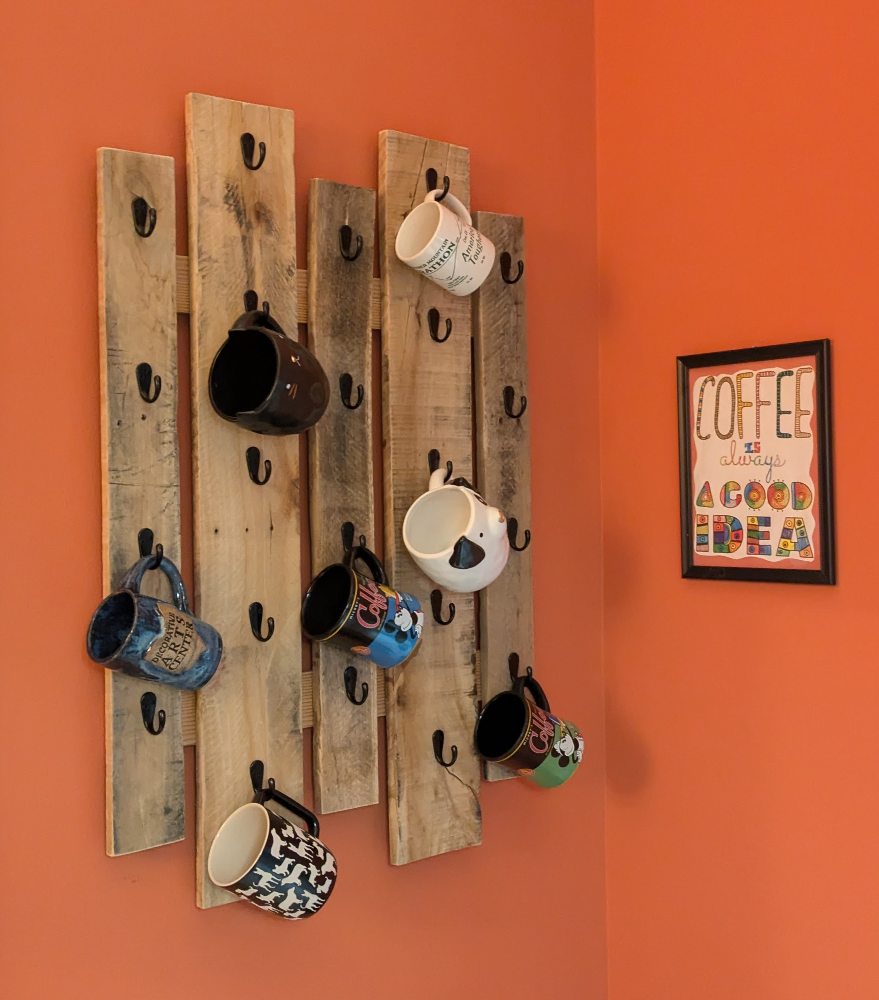

For Lori’s birthday this year, I wanted to make her something meaningful, practical, and just a little bit stylish. Lori has a deep love for coffee mugs, a passion that, despite her best efforts, often overflows cabinets and shelves. Enter the coffee mug rack: a solution for storage, a display for her favorites, and a quiet way to say, “I love you.”

## Design and Materials
I made the rack from recycled pallet wood, a deliberate choice to incorporate the "shabby chic" aesthetic Lori enjoys. The weathered wood adds character, while the alternating-length vertical boards lend it a modern edge we both appreciate. It’s a meeting of styles, much like us.

The rack is designed to showcase her favorite mugs while relieving the storage crisis that inevitably comes with a growing collection. It doesn’t hold every mug, of course—only the most cherished ones make the cut. This keeps the display uncluttered and gives her an excuse to rotate the selection, as if her mugs were art in a gallery.

## The Meaning Behind the Build
Beyond practicality, the rack serves as a reminder of how much Lori means to me. It’s a small gesture, but one that combines thought, effort, and a bit of elbow grease—qualities I hope she recognizes every time she hangs a mug on it.

## Reflection
The coffee mug rack has quickly become a focal point in our home. It’s functional, personal, and (dare I say) stylish. And while it may not stop Lori from bringing home new mugs, it’s nice to know she now has the perfect spot to show off the ones she loves most.

Would I build something like this again? Absolutely. But first, I’ll need to find more pallet wood.
