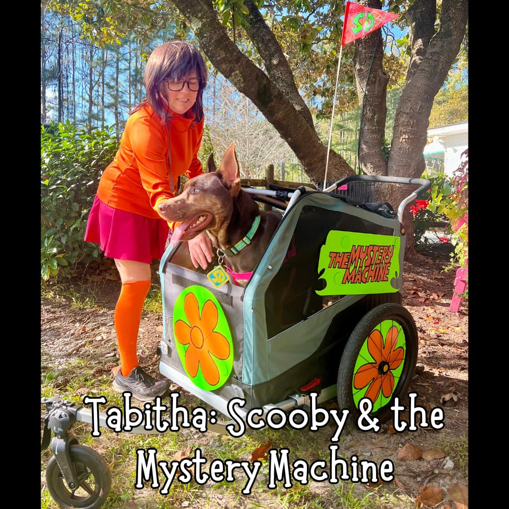

+++
title = "The Mystery Machine: A Halloween Tale of Craft Supplies and Canine Commitment"
date = 2024-10-27
+++

# The Mystery Machine: A Halloween Tale of Craft Supplies and Canine Commitment

This Halloween, our dog, Tabitha (Tabi), became a mobile Scooby-Doo. My wife, Lori, dressed as Velma. Together, they competed in costume contests. I stayed in my natural role: the behind-the-scenes builder of dubious ideas.

The centerpiece was Tabi’s costume—a Mystery Machine fashioned from a Burley Bark Ranger trailer. I’m sure you’re wondering what sort of engineering wizardry went into this creation. I’ll spare you the suspense: it involved posterboard, paper plates, and magnets.

## Construction Highlights
The wheel covers were yellow posterboard circles adorned with red paper plates. The Mystery Machine logo followed a similar formula, with additional printed paper for flair. Magnets attached the decor to the trailer, held in place with gaffer tape because even posterboard deserves industrial-strength support.

A spare wheel decal was added to the front because every good vehicle needs a spare. Whether it would function in an emergency is irrelevant, but it looked convincing enough for Halloween purposes.

## Public Reception
Tabi debuted her Mystery Machine at the Saving Grace Supply Company costume contest. 

[You can see the Facebook post here.](https://www.facebook.com/SGSupplyCo/posts/pfbid0RfTeDuho94BYuWZEqWVvwt9A4FfAkApmtKhfrnZzuKPtoHiDev3FyGa5ASM3H8pTl)

She also participated in events at Dogtopia and Pups in the Park. Audience reactions ranged from amusement to confusion, which, to me, signals success. I’m pleased to report that no one questioned the use of paper plates, which I consider a win for unconventional materials everywhere.

## Lessons Learned
1. Magnets are surprisingly versatile.
2. Gaffer tape fixes almost anything, including posterboard on Halloween costumes.
3. A dog in a costume will always outshine the human who made it.

Would I do this again? Perhaps. Halloween costumes are temporary, but the knowledge that your dog has a better wardrobe than most people is timeless.

In the meantime, I’ll wait for Tabi’s next big event. Maybe next year she’ll get a Batmobile. Or maybe I’ll just buy more magnets.
