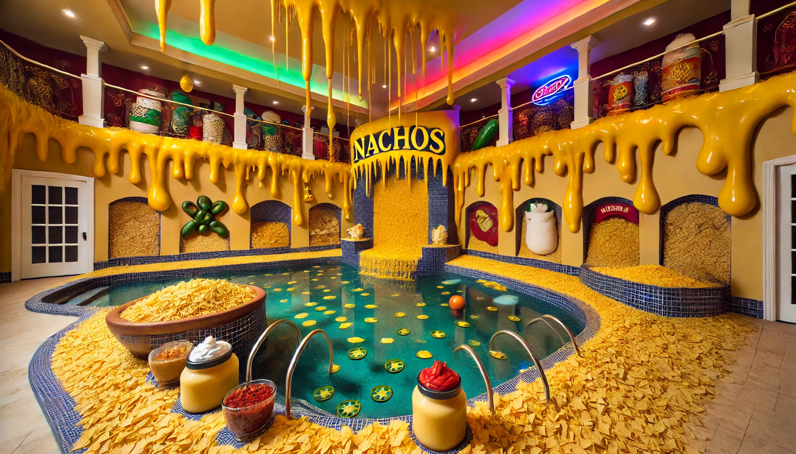
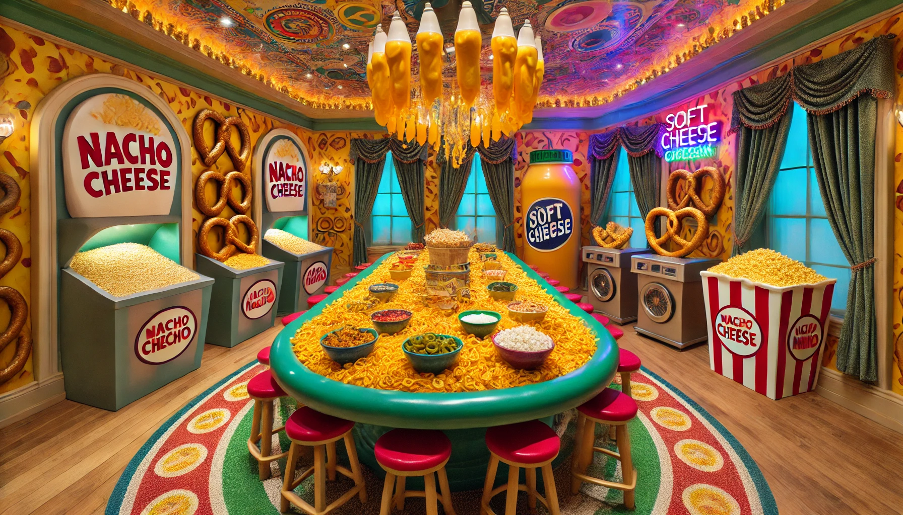

Welcome to the whimsical world of nachos! Imagine a mansion designed for my niece who loves nachos—and I mean *really* loves nachos. This mansion has everything a nacho enthusiast could dream of, from nacho cheese dispensers to a dining room made of nacho chips. Let's take a peek at some of the most fun and snack-filled spaces!

## The Nacho Pool

The indoor pool of this nacho wonderland is something to behold. Instead of water, it's filled with nacho chips, and nacho cheese dispensers line the edges, making it easy to keep your snacks flowing. Floating snack bowls and whimsical jars of toppings like jalapeños, sour cream, and salsa add to the fun, while the colorful neon lights set the playful atmosphere. It’s like swimming in a snack dream!

## The Dining Room of Snacks

Next, we enter the dining room, where even the furniture is made of nachos. The rectangular table is piled high with nacho chips, and nacho cheese dispensers are placed at each end for easy access. Soft pretzels, popcorn, and a variety of nacho toppings are scattered throughout the room in whimsical containers. Of course, the conveyor belt from the pool area snakes through this space as well, delivering even more snacks as you dine. A chandelier made of nacho cheese packets and popcorn kernels hangs above the table, completing this snack-filled haven.

This mansion is the ultimate paradise for anyone who loves nachos and fun food-themed spaces. Stay tuned for more whimsical tours from this world of nacho-inspired imagination!

