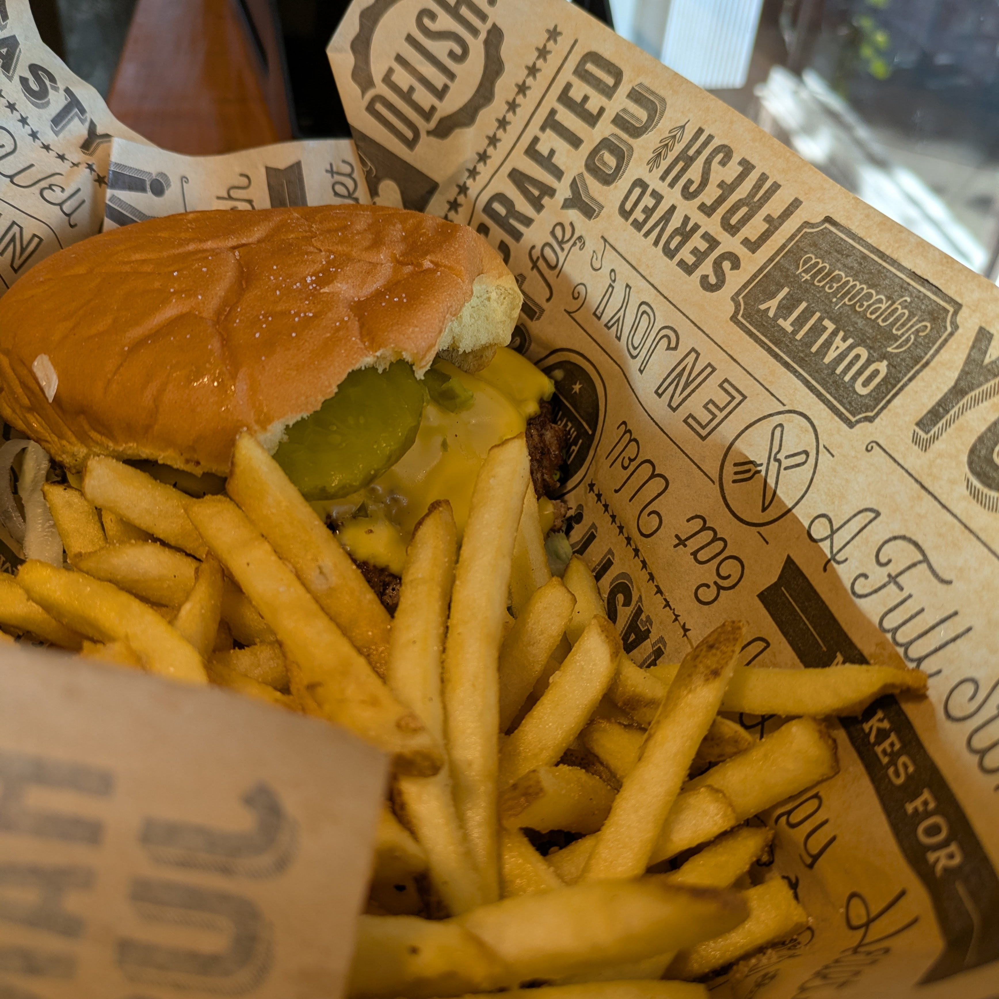
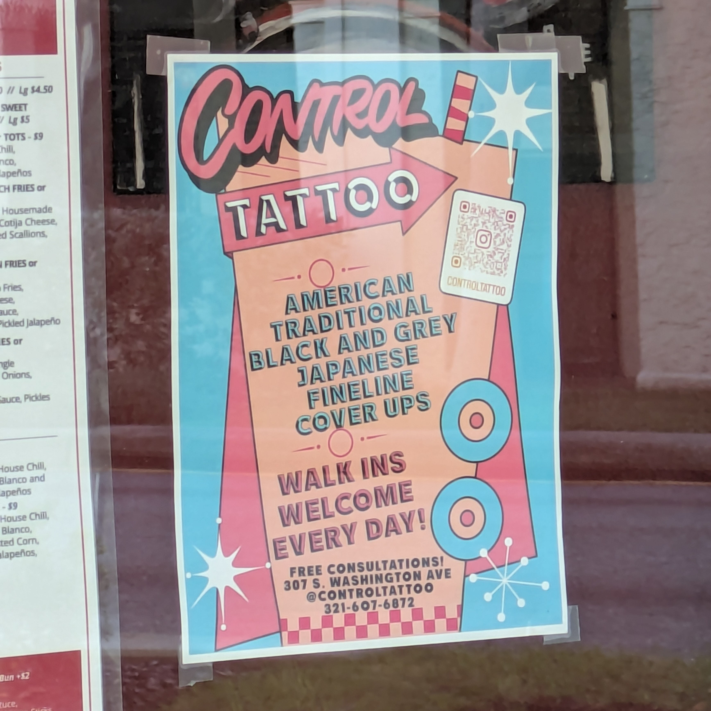
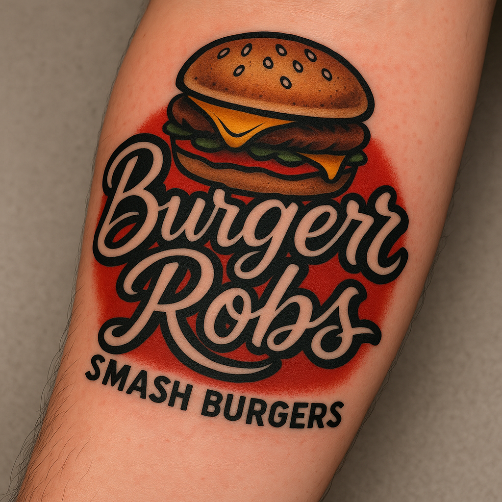

[A stray cumulus cloud scrubbed the SpaceX Crew-11 launch at T-1](https://spaceflightnow.com/2025/07/31/live-coverage-nasa-spacex-to-launch-crew-11-mission-to-the-international-space-station-on-a-falcon-9-rocket-from-the-kennedy-space-center/), which meant another night in Titusville and an unexpected detour to [BurgerRobs](https://www.burgerrobshq.com/) downtown. 

The Classic Cheeseburger arrived with crispy, golden fries, hot enough to risk third-degree burns.  

I texted a quick photo and description to Lori, knowing full well that, in some jurisdictions, flaunting fries like these would be grounds for divorce. While pondering the possible fallout, I spotted a tattoo shop flier.

Naturally, I asked AI to render a tattoo of the BurgerRobs logo. 

When I showed the result to the server, she insisted I send it to Rob. She suggested that I might get burgers for life if I actually got the tattoo.

This prospect comes with an obvious caveat: a lifetime supply of BurgerRobs burgers may, shorten the very life it supplies. The nine hour drive would only slow me down a little bit.
