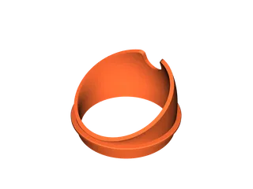

My feline minions demanded ergonomic dining, and I am nothing if not a benevolent overlord—provided it advances my agenda. Also, Lori (my most trusted consigliere) issued a “polite suggestion” to fix it, which in our hierarchy counts as an order. The raised bowl stand in the lair refused to fit their existing bowls and sat at a disappointing right angle. Unacceptable.

I designed and printed an adapter that does two things with ruthless efficiency: it mates the stand’s holes to the bowls I already owned, and it tilts the bowls a satisfying **30 degrees** so whiskers and spine stay aligned while they refuel for future henchwork.

Parametric model for your own feline forces: [Tilted Cat Food Adapter](https://www.printables.com/model/1506588-tilted-cat-food-adapter).

## Field Test Report

- **Fit check:** snug in the stand, zero wobble, bowls locked in like loyal guards.  
- **Angle of attack:** 30-degree tilt keeps kibble corralled and heads low; no more craned-neck complaints.  
- **Minion feedback:** immediate adoption, accelerated consumption, louder purrs—clear signs of allegiance.  
- **Overlord benefit:** no new bowls purchased, lair aesthetics preserved, minion morale fortified, Lori appeased.

Status: feline provisioning optimized. The empire marches on—on a full stomach.
