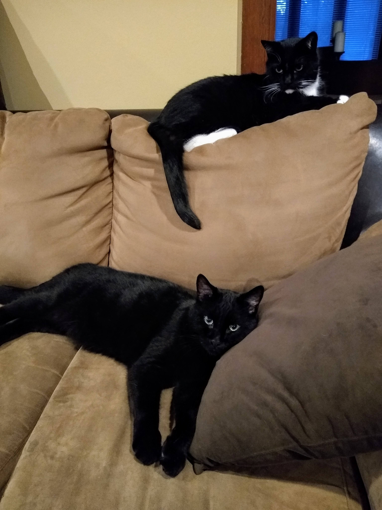
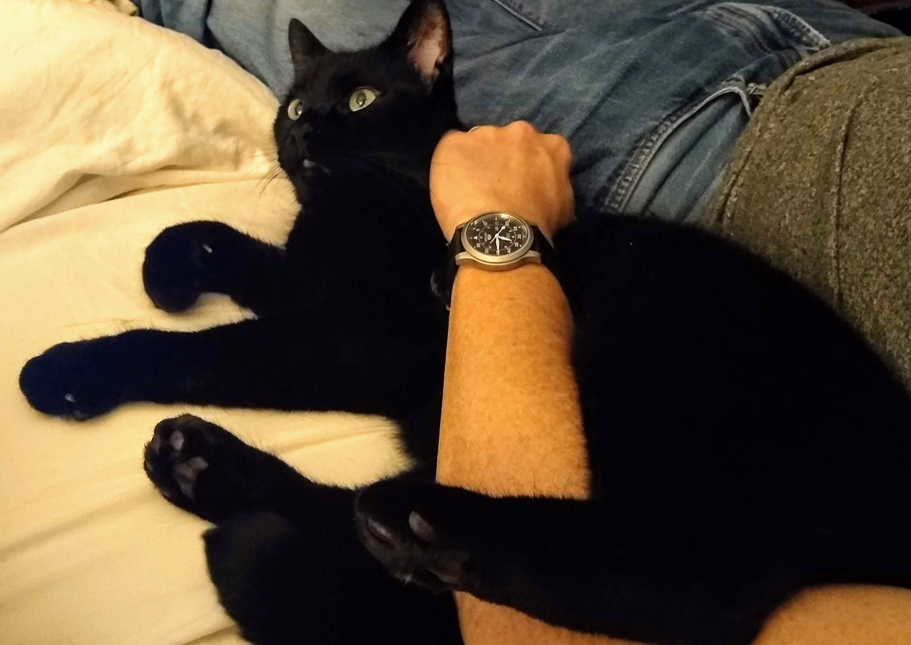
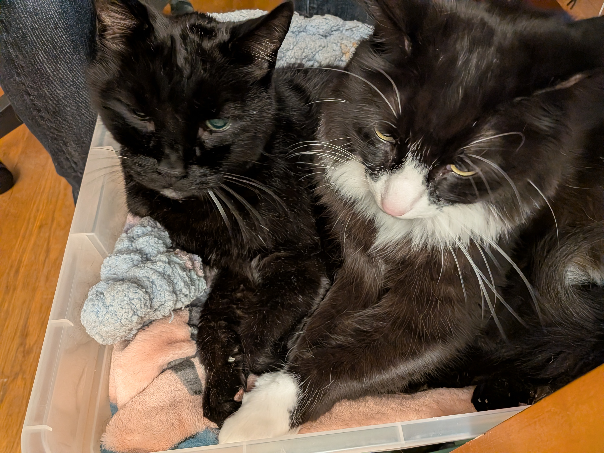
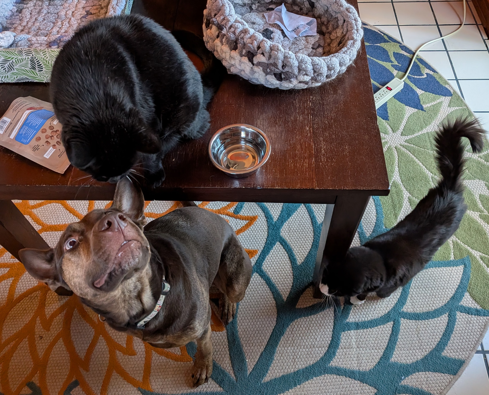

Cody chose Lori first.

He was tucked under his tuxedo brother Spencer when we met them, the bigger and more cautious of the pair we would bring home together. But he peeked out, made eye contact with Lori with those green eyes, and that was that. On Saturday, March 2, 2019, we adopted Cody and Spencer at nine and a half years old.

Cody chose me later that same night.

He had every reason to stay hidden. New house, new people, new sounds, new smells. Instead, he crept out from under the bed and laid himself along my leg. That was Cody's way. He did not rush trust, but when he gave it, he gave it completely.

He was the bigger brother, heavier than the heaviest bowling ball, with huge paws and claws that looked like they could do damage. He never used them that way. Cody was soft with us. Gentle. Careful. Built like a heavyweight and equipped with the heart of a nervous little gentleman.

For most of his life with us, he was the afraid one. Company came over and Cody vanished. Thunder rolled through and he disappeared. But if Lori or I yelled out, or if something loud and alarming happened in the house, he came running. Fearful as he was, he still wanted to know whether we were okay.

After Spencer died, Cody changed. He became braver because someone had to. He started coming out for other people. He got better during thunderstorms. He became, somehow, the brave big brother to Jeff, another tuxedo.

That courage was never loud. It was not dramatic. It was a quiet decision he made over and over again: to stay nearby, to try, to trust the room a little more than he had before.

He made room for the rest of the household, too. He tolerated the strange social physics of cats and dogs gathered around the same table, everyone hoping the good snacks might appear. He was part of the daily orbit: Cody, Tabi, Jeff, Lori, me, and the small routines that make a house feel held together.

Cody loved leg nests, face scritches, chicken, and being played like a bongo drum. He loved in solid, physical ways. A lean. A flop. A heavy presence against your leg. A huge black cat arranging himself beside you as if the whole point of furniture, blankets, and people was to make a place where Cody could be close.

Cody died today.

There is no good sentence for that. There is only the shape of him missing from the house, and the memory of all the ways he filled it.

He chose Lori. He chose me. We chose him and Spencer, and later he chose to be brave for Jeff. We were lucky to be trusted by him.

We loved Cody dearly.
