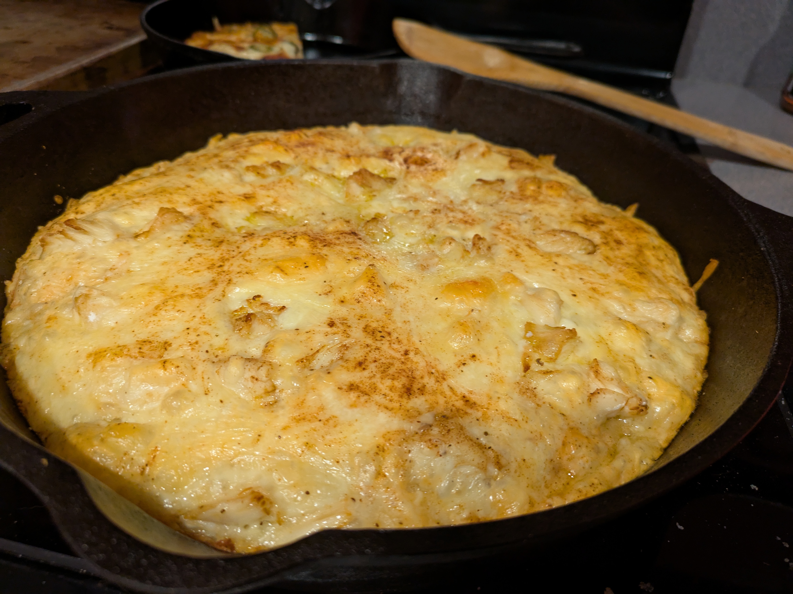

Crab pizza is a savory twist on classic pan pizza, blending the rich flavors of fresh crab meat with a touch of Chesapeake-inspired seasoning. Based on Kenji’s foolproof dough, this recipe takes inspiration from the legendary Chesapeake Pizza at Bottom's Up Pizza in Historic Shockoe Bottom, delivering a mouthwatering taste of the coast in every bite.

## Ingredients
- [Pan Pizza Dough](). This recipe is for the **12-inch pan**.
- 1 additional Tbsp olive oil
- 3 garlic cloves, minced
- Red pepper flakes
- ¼ thinly sliced red onions
- 6 oz shredded mozzarella cheese
- 8 oz jumbo lump crab
- Old Bay Seasoning

---

## Instructions

1. **Make the dough**
  Follow the [Pan Pizza Dough]() recipe. This recipe is for the **12-inch pan**.

1. **Top**
  Top with olive oil, garlic, red pepper flakes, and Old Bay seasonging. Add cheese layered with most of the crab. Add onions, remaining crab, and more Old Bay seasoning.

1. **Bake**
  Bake as per the pizza recipe's instructions and serve immediately.
