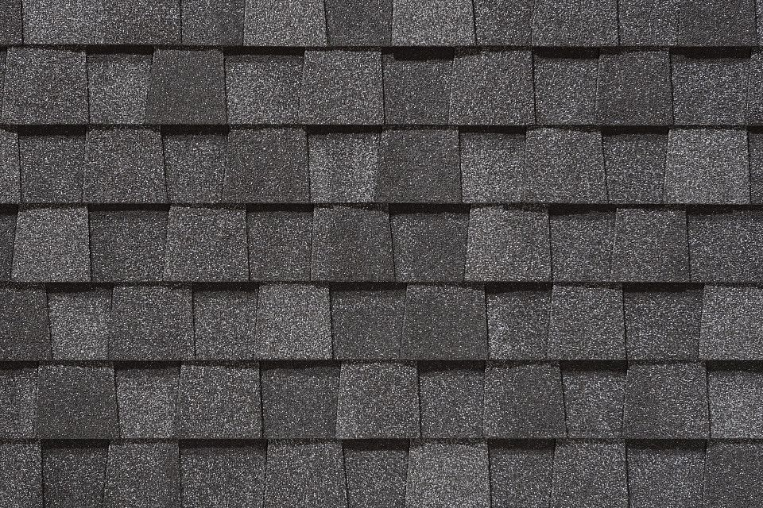
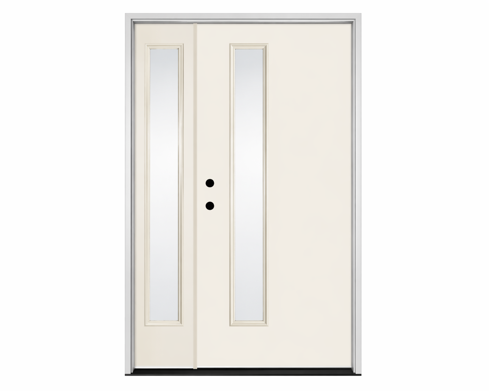
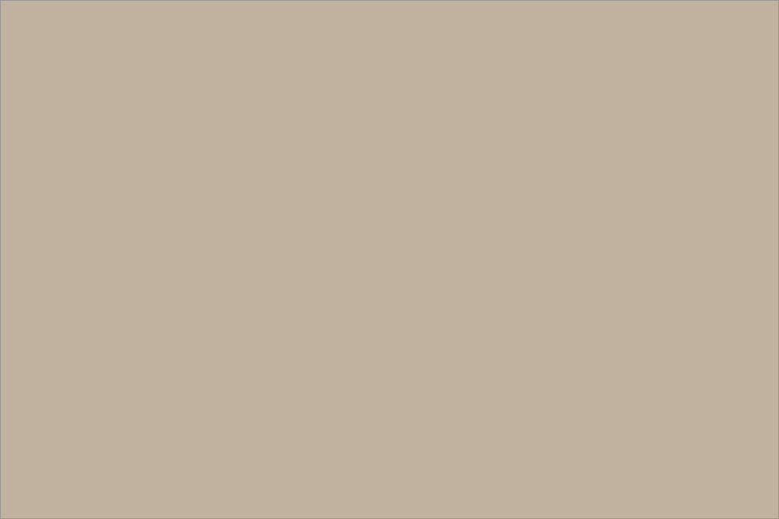

## Roof tile

CertainTeed Landmark Architectural Shingles - Pewter

## Front door

Therma-Tru Smooth-Star S2000 Flush Fiberglass Entry Door - Left Sidelite (18" Clear Low-E), Reeb Prehung System

## Front door color

Red Cent (Sherwin-Williams SW 6341)

## House color

Charcoal Blue (Sherwin-Williams SW 2739)

## Soffit color

Web Gray (Sherwin-Williams SW 7075)

## Existing trim color

Cashmere (Marvin Essential Finish)

