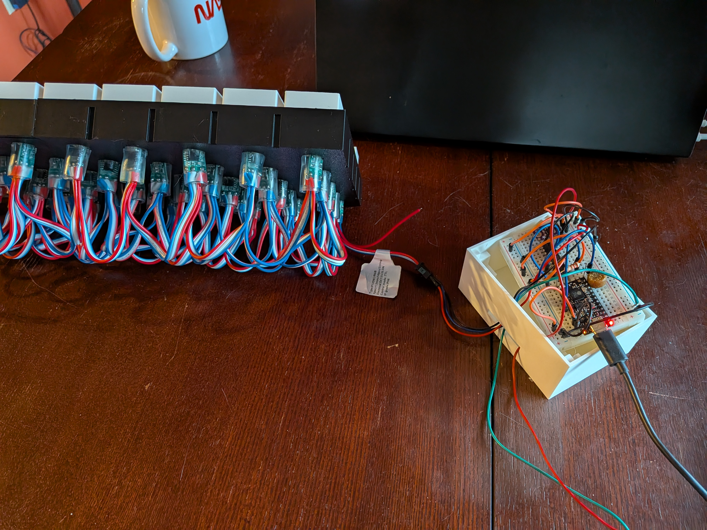
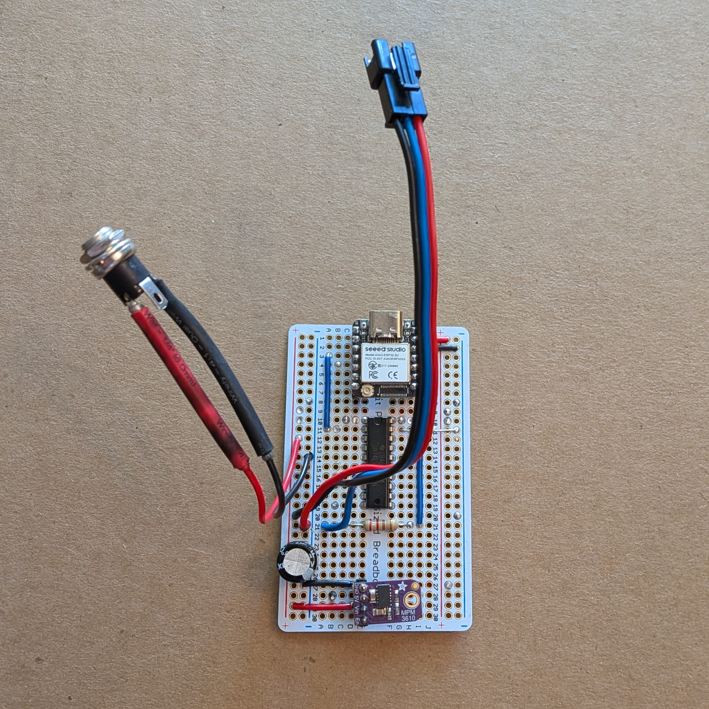
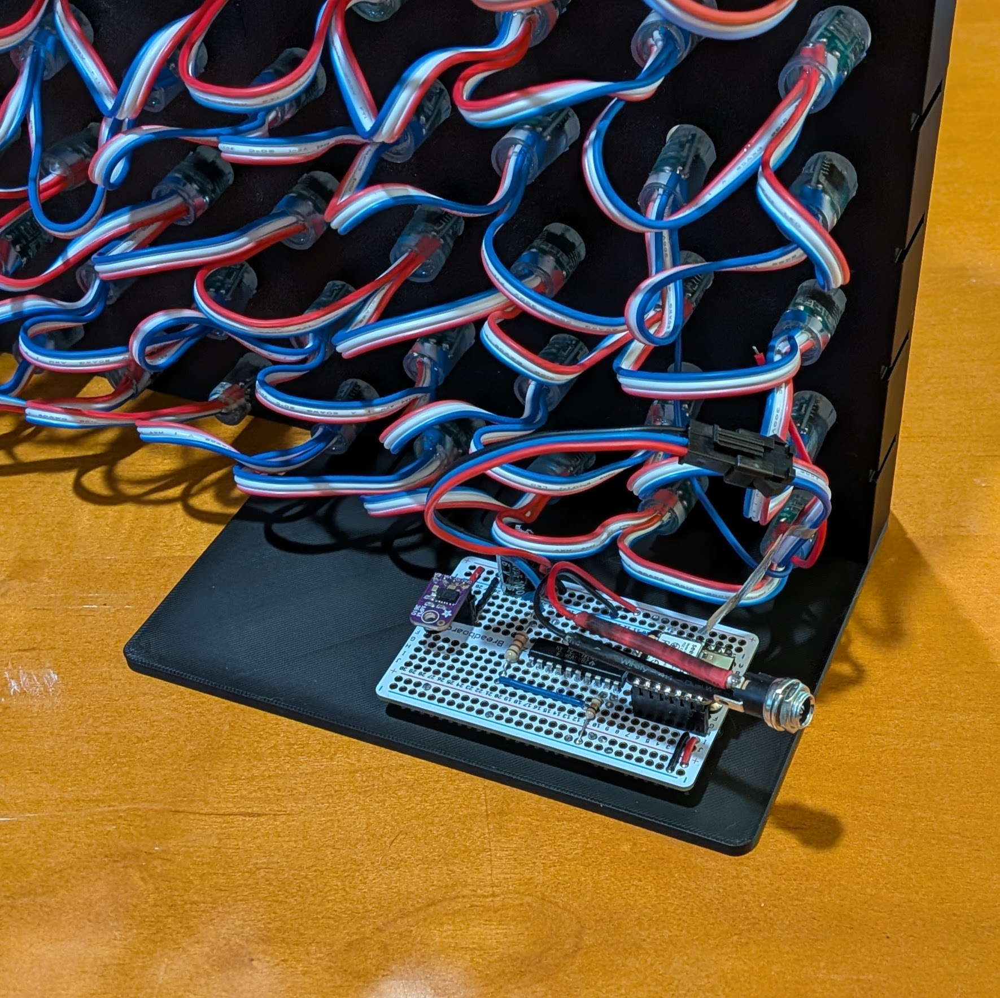
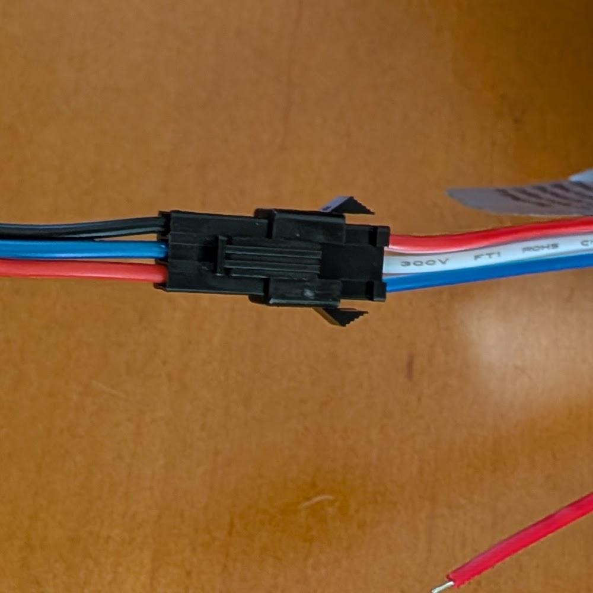
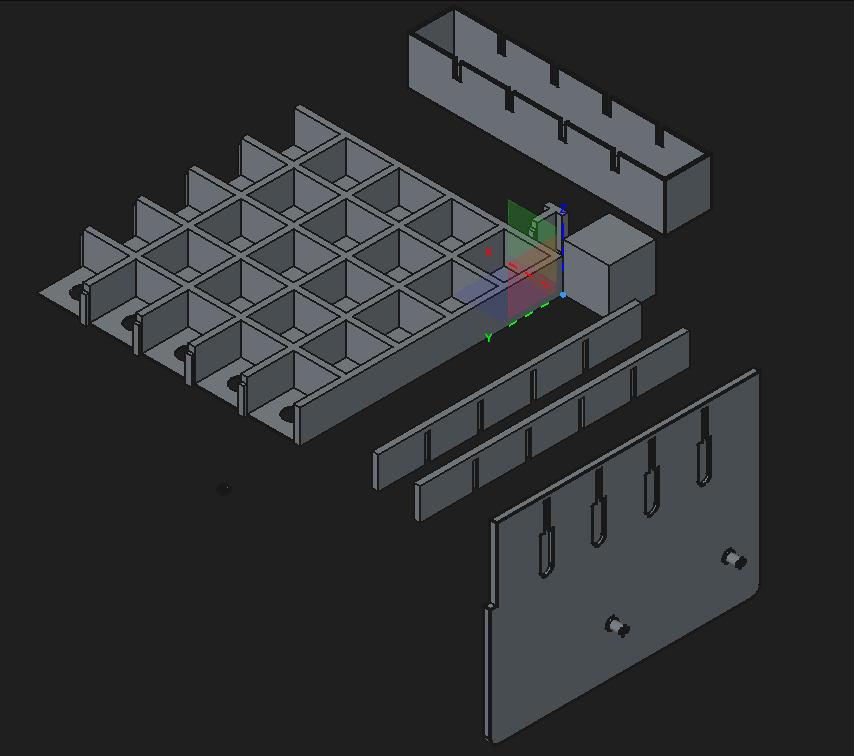

I started with a much larger and more ridiculous idea.

The plan was to fill the big front windows with addressable LEDs. Something interactive. Maybe Tetris. Maybe holiday animations. Maybe a faux retro computer display that looked like the WOPR had moved into the living room and was waiting for someone to ask about global thermonuclear war.

This was before I had a 3D printer. It was before I had done much with microcontrollers. It was before I knew just enough electronics to make a small glowing thing and then confidently blame the wrong part when it did not glow.

The big-window version ran into three problems.

First, that would be a lot of LEDs. A lot of power. A lot of wiring. A lot of places for small mistakes to hide.

Second, the test grid was already interesting.



Third, the display would block the window.

That last one proved inconvenient. Windows, I am told, have an established purpose.

So the giant window Tetris wall turned into something better: a finished 10×10 LED display that lives in an IKEA KALLAX shelf, next to the gin, cookbooks, and other small 3D-printed evidence of a productive problem.

Lori said it could stay in the house, which is the maker equivalent of a certificate of occupancy.

## The display

The finished display is about 330 mm square. It has 100 large square pixels, each about 28 mm across, which puts it in the useful range between "indicator panel" and "very bad television."

Each pixel uses a diffuser printed from white matte PLA. The diffusers are hollow square shells printed in vase mode, and they press-fit into the backplane. Behind them are two serially connected WS2811-style 12 V LED strings routed in a serpentine pattern.

The frame is 3D printed. It uses four 5×5 backplanes plus separately printed edge pieces. The backplanes are parametric, so the same design can generate other sizes. At this pixel size, 5×5 is about as large as I can conveniently print on the Bambu P1S bed.

The parts lock together with dovetails. Getting that press fit right took many iterations. Too loose and the display feels sloppy. Too tight and assembly becomes a small plastic-themed strength test.

The final fit is tight. This is the correct answer, because it worked.

## The pixels wanted to be physical

I did not want this to look like a small monitor. I wanted it to look like a piece of hardware.

The design goal was 1960s and 1970s computer-room ambiance: big pixels, visible grid, chunky light, and just enough blinkenlights to suggest that something important may be happening, even if it is only reporting that it is 72 degrees and cloudy.

One of my favorite demos is modeled after Dave Plummer’s PDP-11 front panel. Strictly speaking, a PDP-11 is minicomputer territory rather than mainframe territory, but it has the right front-panel language: rows of lamps, switches, addresses, data, and random-seeming activity that makes old computer lights so satisfying.



The normal weather display is calmer. It shows the current condition and temperature. A Python client on the Raspberry Pi fetches current conditions from a weather API, turns that into a tiny scene, and sends the resulting pixels to the display. On a day with scattered clouds, that might mean a blue background, a gradient into white clouds, and yellowish digits for the temperature.

The animations make it fun. Clear night originally meant the temperature over a mostly black background. Later I added an occasional shooting star. It tells you the same information, but now it has a tiny bit of life.



Rain, sleet, snow, and fog all took visual tuning. The software has numbers for colors and rates, but the real test was whether the display felt right from across the room.

Digital output, analog judgment.

## Electronics, with only mild self-ownage

The electronics were not the hard part. There are many good guides, videos, and examples for driving addressable LEDs from ESP32-style boards. [WLED](https://kno.wled.ge/) exists. Dave Plummer’s NightDriver exists. The path is well lit by people who have already released the smoke from their own components.

I started with a breadboard prototype using an [Unexpected Maker TinyS3](https://esp32s3.com/tinys3.html). Later I moved to a [Seeed Studio XIAO ESP32S3](https://www.seeedstudio.com/XIAO-ESP32S3-p-5627.html) on an [ElectroCookie solderable breadboard](https://www.amazon.com/stores/ElectroCookieInc/page/22B2033E-D23A-49A5-8137-DF64DA93923D). It is soldered and no longer flaps around on a breadboard, so it counts.

The controller has:

- [XIAO ESP32S3](https://www.seeedstudio.com/XIAO-ESP32S3-p-5627.html)
- Level shifter for the LED data signal
- Buck converter to make 5 V for the controller from the 12 V supply
- Barrel jack for 12 V power
- Connectors for the LED strings
- Capacitor across the power input
- Two resistors for the control wiring

The display runs from 12 V and needs only a few amps for how I use it. A 100-pixel display could draw much more at full white, so the software keeps the brightness in the "visible across the room" range rather than the "portable sun" range.

Here is the finished assembly from the rear, with the installed board centered in the build.

The transition from breadboard to soldered board went well, except for two mistakes.

First, I connected the LED data line to the wrong XIAO pin. I used pin 4 instead of pin 3.

Second, I trusted wire colors.

The female connector on the LED string used blue for ground, white for data, and red for voltage. My matching male connector used red, blue, and black. I assumed the colors mapped sensibly. They did not. Ground and voltage were swapped between the two connector implementations.

For a moment, I thought I had destroyed the LED strings. Fortunately, after correcting the connector wiring and the data pin, the LEDs survived, which was generous of them.

## The important software decision

At first, I started putting everything on the controller. That worked, but the development loop was slow:

Write ESP-IDF code. Build. Flash. Test. Repeat.

I like hard mode, so I used ESP-IDF rather than Arduino or MicroPython. That is fine for firmware, but not ideal when you want to iterate on animation behavior.

The big software improvement was making the controller a simple network display endpoint. It receives pixel data over UDP using DDP, the Distributed Display Protocol used by tools like WLED, and displays whatever it receives.

That changed the project.

Instead of rebuilding firmware every time I wanted better fog, I could write Python clients and iterate quickly. The clients run as Docker containers on a Raspberry Pi 3B that already handles several other household jobs. The display clients are lightweight, so the Pi is plenty.

Right now, one client controls the display at a time. The DDP receiver accepts data from any sender. I looked into doing control arbitration on the controller, but DDP does not really provide a clean ownership model. If I add that later, I will likely do it in a client.

This was the main architectural lesson:

Put the slow hardware flashing path behind a small protocol. Move the creative work somewhere fast.

## CAD was the real boss fight

The hardest part was not the LEDs.

It was CAD.

This model was an early serious attempt at parametric design. I made it ambitious from the start. It had variables for dimensions, which is normal enough, but also integer parameters for rows and columns. It had many bodies. It had dependencies. It had opinions.

When I designed features in the wrong order, later changes became painful or impossible. Several times the loop became:

Learn. Revert. Restart. Try again with better dependencies.

That is an effective learning process, but it has poor ergonomics.

I started the design in FreeCAD around 0.22 and later moved to FreeCAD 1.0.x. If I started over, I would make the model cleaner with a master sketch, a more deliberate body hierarchy, and better use of subshape binders.

The printer itself was not the problem. The Bambu P1S worked well. I even accidentally printed one of the four backplanes in PETG instead of PLA, and it still fit with the others. Maybe it is a little tighter. Maybe not. It works.

Once the model was right, the printer mostly just made the parts.

That feels like cheating, which I believe is one of the main benefits of owning a good 3D printer.

## What I would copy

This project is not about making a tiny television.

The thing worth copying is the pixel/mainframe ambiance.

A low-resolution physical display has a different feel from a screen. It is worse at almost everything a screen does, which makes it better at being an object. It can sit on a shelf and quietly be itself. Weather display, PDP-11 cosplay, holiday lights, pointless animations, useful glanceable status, all from the same hardware.

You do not need my exact design to build something like it.

You need a microcontroller, addressable LED strings or strips, a way to mount and diffuse the pixels, and software to send pixels. The mount could be 3D printed. It could be foamcore. It could be ping-pong balls if you are following [bitluni's ping-pong-ball LED wall](https://hackaday.com/2019/05/17/a-ping-pong-ball-led-video-wall/), which is how this line of thought originally got into my head.

Mine ended up as a 10×10 shelf mainframe.

The window-sized Tetris wall can wait.

Or maybe it already did its job by tricking me into building this.
