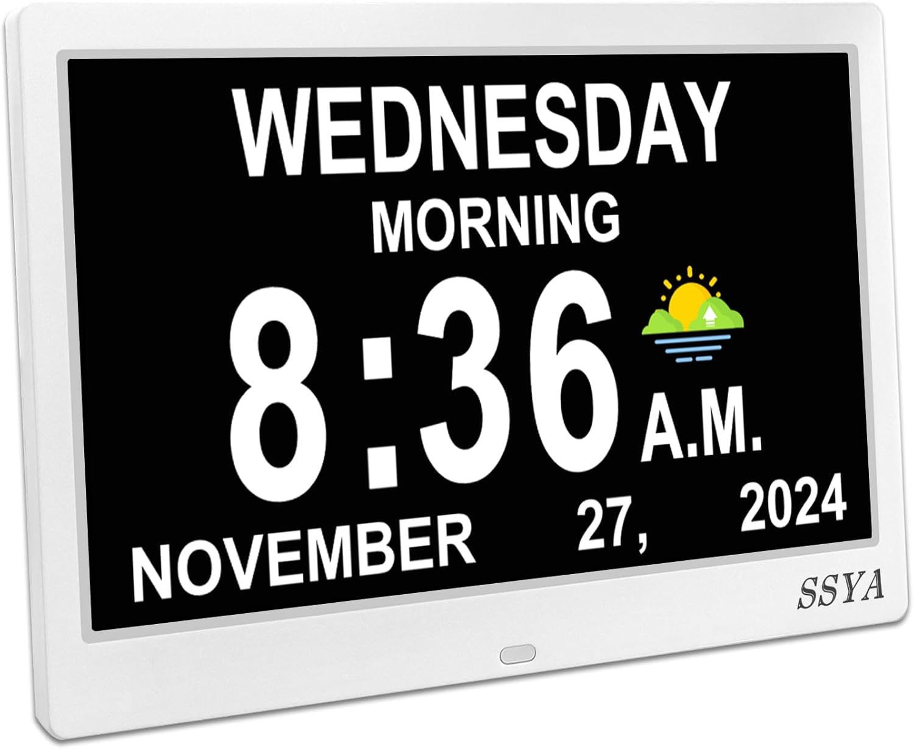
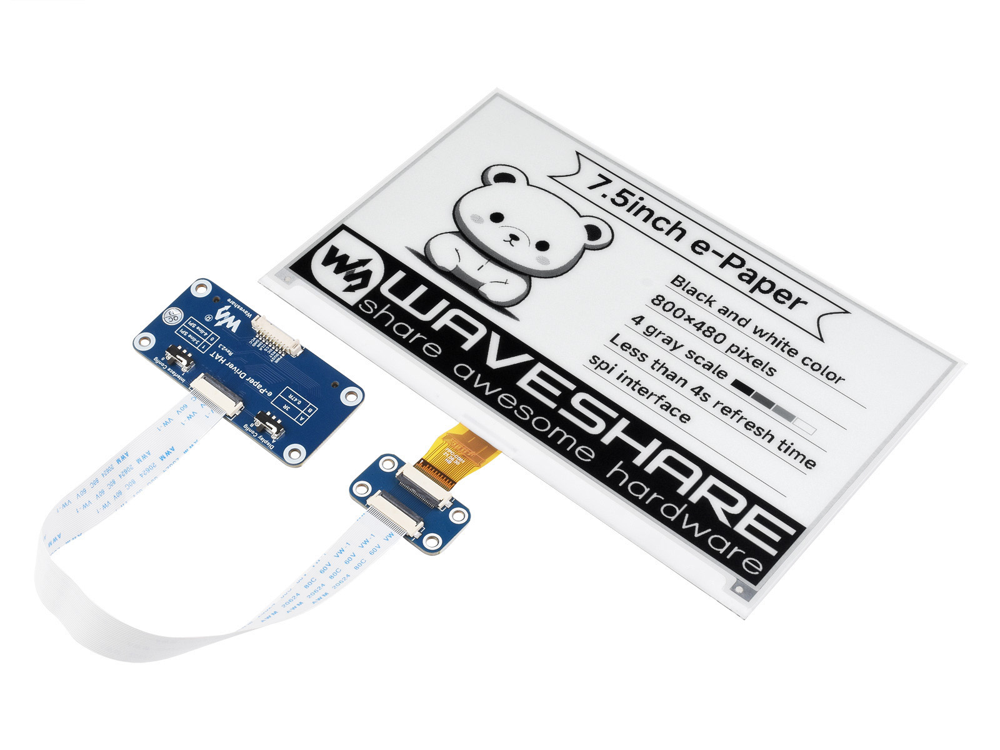
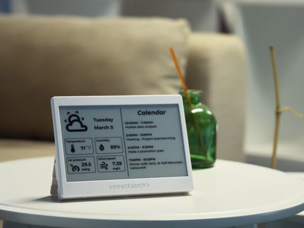
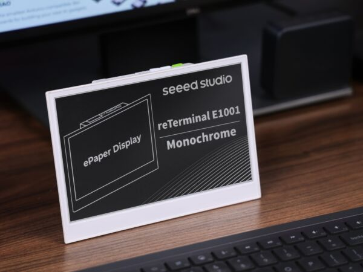
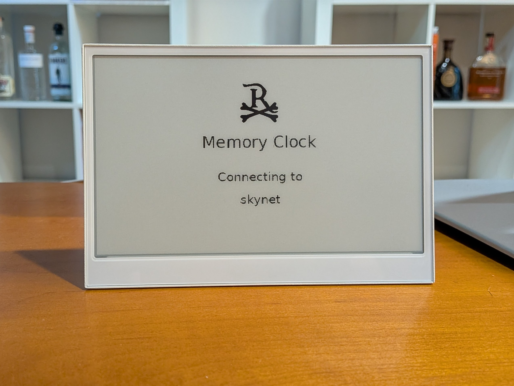
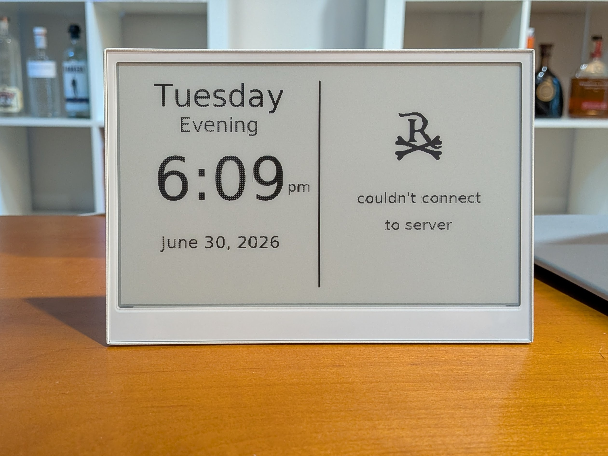

I built a desk clock that does two jobs: it works like a clock, and it keeps an appointment plan visible.

It shows the day, date, time, and part of the day in a calm, easy-to-read format. It also shows upcoming appointment pages that I can update from a server. The goal is not to make a more interesting clock. The goal is to make the next thing visible without requiring a phone, a paper calendar, or someone nearby to explain the plan again.

## The Problem

My mom's occupational therapist recommended a special kind of clock: a simple display that shows the time, day of the week, date, and part of the day. These are common devices, and they are useful for exactly the reason they sound useful. They reduce the amount of remembering required just to stay oriented.

This kind of clock is easy to buy. The one below has a 7-inch screen and costs about $30.

The clock part was only half the problem.

Since January 2026, we have also been managing a heavy appointment schedule. By the end of June, we had logged 99 appointments. Most came from MyChart, but not all. Each appointment could have several times attached to it:

- appointment time
- arrival time
- transportation pickup time
- family pickup time
- time when a family member would meet her there

There could be multiple appointments at the same location, or different appointments at different locations on the same day. Appointments moved. Instructions changed. The official appointment names were not always helpful either:

- `SIMULATION`
- `RETURN ACTIVE UNCHCS`
- `PATCONSULT`
- `TREATMENT`

I handled this for a while with a printable two-week calendar. Each entry had a plain-language description, time, and location. For groups of related appointments, I added notes like: "Transportation will pick you up at 11:30 AM. Taylor Swift will meet you there at 11:50 AM."

That paper system worked when I could update it in person almost every day. It works less well when the calendar changes after the paper has been printed.

The data behind it also evolved. I started with an HTML document and stylesheet for the paper version. I keep a real calendar of MyChart and other appointments, annotate the entries, and document the rules I want a large language model to follow when turning that source material into something useful. For the clock version, the output became YAML instead of paper-oriented HTML.

## The Idea

The obvious answer was to combine the two tools: a "memory clock" plus an appointment display.

For the person using it, the device should be boring:

- show the current time and date
- show today's next appointment or plan
- let left and right buttons move through pages
- let the green button return to the first page from anywhere
- keep working as a clock even if the network is down

For me, it should be easy to maintain:

- edit calendar entries on a server
- let the clock fetch updates automatically
- avoid re-flashing firmware for ordinary calendar changes
- keep the data private enough that only known devices can fetch it

## Hardware Choices

My first thought was to build the whole thing from parts: a 7.5-inch e-paper screen, a controller, an ESP32, and a 3D-printed case.

That was plausible, but it would have made the enclosure, wiring, battery, buttons, and charging part of the project. I wanted those to be solved already.

The next candidate was Seeed's [XIAO 7.5-inch ePaper Panel](https://www.seeedstudio.com/XIAO-7-5-ePaper-Panel-p-6416.html). It was closer: an ESP32-C3, 800x480 e-paper display, battery, and a case.

Then I found the [Seeed Studio reTerminal E1001](https://www.seeedstudio.com/reTerminal-E1001-p-6534.html). This is more of an object I wanted to hand someone:

- metal case
- 7.5-inch e-paper display
- three buttons on top
- battery
- real-time clock

That changed the project from "build hardware" to "write the right firmware and server." The code is on GitHub here: [rhew/memory-clock](https://github.com/rhew/memory-clock).

## What The Clock Does

The first page shows the clock on the left and the next appointment page on the right. After that, both sides of the screen are available for appointment pages. The clock renders the local time itself. Appointment pages come from the server as simple black-and-white image data.

That split matters.

If the network is down, the device should still be a clock. It also keeps the appointment pages it already has. Losing updates is annoying. Losing the current time, or blanking already-loaded appointments, would make the whole object feel broken.

## Startup

The startup screens are part of the product, not just debugging output. They answer the question a non-technical person will naturally have: "Is it working?"

The clock starts by checking each dependency in order:

1. Connect to Wi-Fi.
2. Sync time from a network time server.
3. Contact my calendar server.
4. Download the current appointment pages.

If the clock can set the time but cannot reach the calendar server, it should still show the clock and make the failure obvious. The right answer is not a silent blank area. It is a clear error screen and a retry later.

## The Software Split

My first prototype used ESP-IDF, LVGL, and C++. It had the same basic time-and-date features as a regular memory clock. That was enough to prove the device could do the job, but it also showed where the work should not go.

Rendering appointment pages on the device would mean writing more layout code in C++. Appointment text has wrapping, spacing, dates, headings, and edge cases. That is much easier to iterate on in Python.

Rendering everything on the server had the opposite problem. A full clock face would be wasteful to send over the network, and the clock should not depend on my server for every minute change.

The compromise is:

- firmware renders the clock, date, and navigation
- Python renders the appointment pages
- the server sends compact monochrome page images
- the device caches those pages
- left and right move through pages, while the green button returns to the first page

For the clock text itself, I also moved away from LVGL. I generate the small set of glyphs the clock needs at build time, then the firmware places those glyphs directly. It is less general, but this project does not need a general UI toolkit.

On the server, I considered browser-based layout for appointment pages. I ended up using PIL instead. Drawing text and borders directly was simpler than bringing in a browser just to make half-screen monochrome calendar cards.

## Server Flow

The server is a small Python service behind my existing Caddy reverse proxy. It reads:

- calendar entries from a YAML file
- allowed device token hashes from a JSONL file

The clock polls a private endpoint with a bearer token. If the token matches a known device, the server returns metadata plus paths for rendered page images. The device then fetches the page image data it needs.

The server also honors `If-Modified-Since`, so the clock does not have to download pages again when nothing changed.

Updating the calendar is intentionally low ceremony. I maintain the real appointment calendar, annotate it, and keep the generation rules alongside it. The resulting YAML is what the server reads. Once that YAML changes on the host, the next clock poll sees the updated server state and refreshes the appointment pages.

## Tradeoffs

The biggest simplification is Wi-Fi configuration.

I tried building a captive portal for Wi-Fi setup. I have a working captive-portal approach in my [mainframe-style weather display](../mainframe-display/), so this was not unfamiliar territory. I also tried adapting a portal from another ESP32 project. Both paths consumed more time than the feature was worth for this version.

For now, Wi-Fi credentials are built into the firmware from a `.env` file. That makes the device easy to build and reliable once installed, but changing networks requires a reflash.

That is acceptable for this use. It would not be acceptable for a product.

## What Is Next

The current version is intentionally plain. I picked fonts by stopping at the first thing that did not look terrible. The clock font and appointment font do not match exactly. The layout is simple because simple is easier to trust. My brother is better at this kind of visual design than I am, so I expect he will have useful opinions once he sees it.

The next improvements I might make are:

- better visual design
- remote flashing
- log and error retrieval
- battery indicator

I am not planning to formalize the calendar-data generation. A real product would probably connect directly to your calendars, provide a lot of configuration, and maybe offer a service or subscription to handle the interpretation and reminders. That is not the project I need. For this version, a real calendar, annotations, written rules, and generated YAML are enough.

The useful part is already there: the clock can stay boring, the calendar can change, and the person looking at it does not need to know how any of that works.
