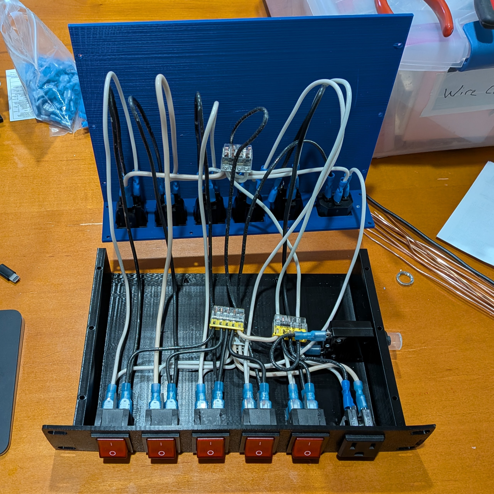
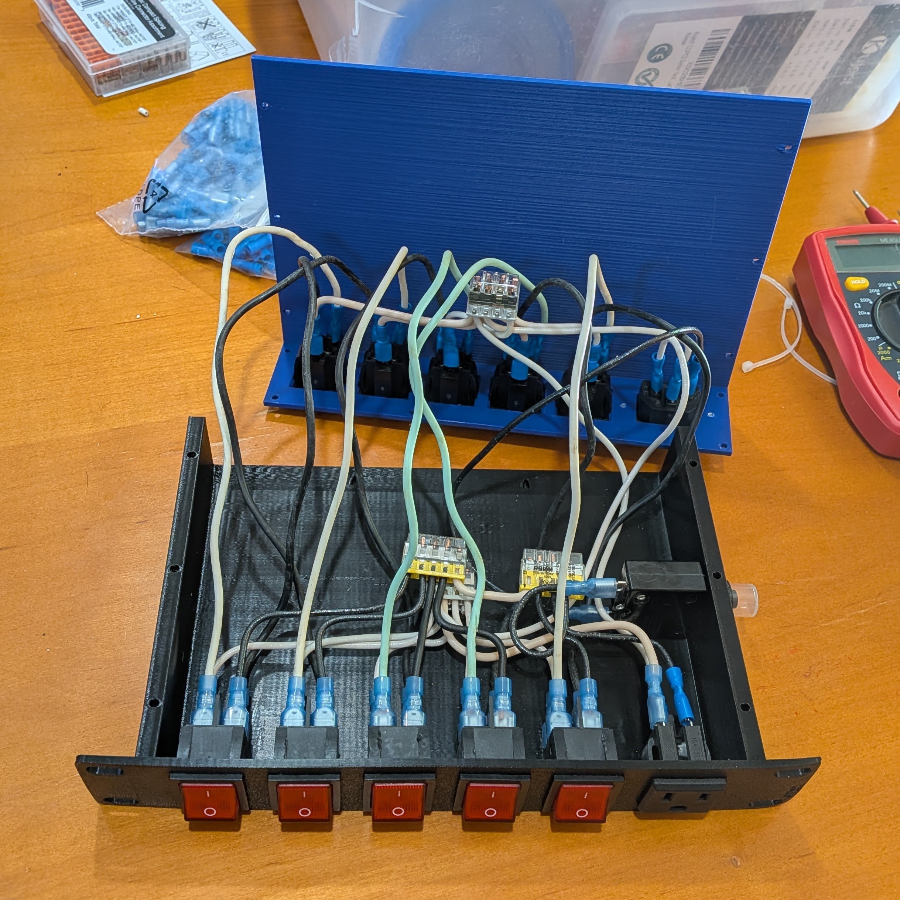
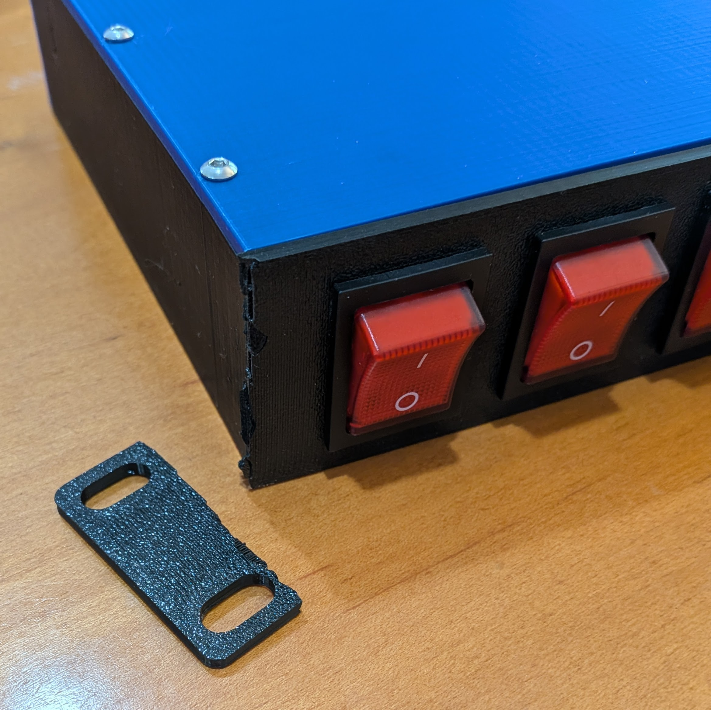
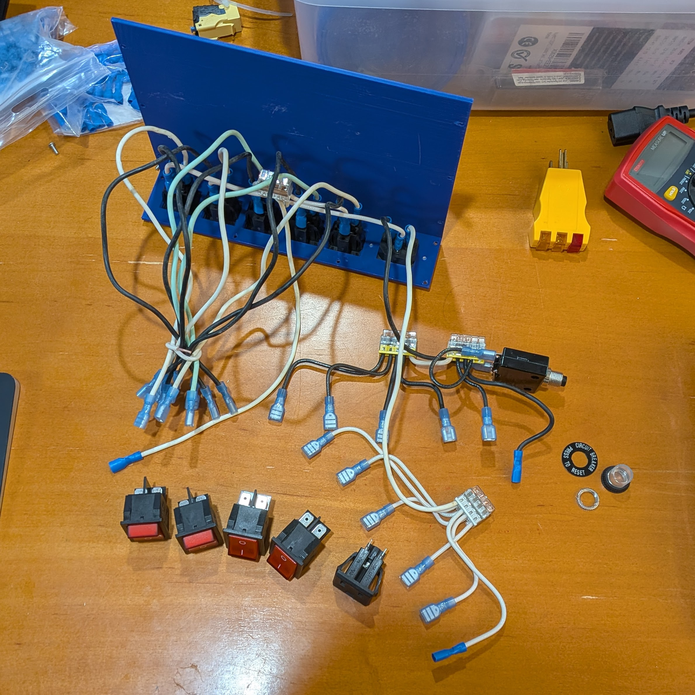

This is the power side of my [network rack build](../network-rack). The rack itself is small enough that I wanted a matching PDU instead of just stuffing a power strip behind everything and hoping for the best.

`torth3`'s PDU case model on Printables was exactly what I was looking for but needed a couple of fit changes:

- The power inlet opening needed to be enlarged so the specified part would fit.
- The mounting hole spacing changed from 35 mm to 40 mm.

Those were small edits, but they made the difference between “close enough” and “actually usable.”

I published the modified part as a [remix of the PDU cover](https://www.printables.com/model/1719822-remix-of-torth3s-10-inch-rackmount-pdu-cover-with), and I linked it back from [my make on the original model](https://www.printables.com/make/3422354) so the fix is easier to find.

## Wiring Lessons

I started with Romex for all of the internal wiring. It worked on paper, but it was difficult to assemble in the cramped enclosure. The crimps were fine, but the solid-core wire was so stiff that closing the box could pull the female connector off the male tab on the component.

I replaced the hot and neutral wires from the rear outlets to the front switches with stranded 16-gauge wire. That made the assembly much more forgiving, even if it was still tight.

Wago push-in connectors worked well for the first build. They made the cramped solid-core wiring easier to assemble and rework. With stranded wire throughout, I probably would not need them, but they worked well enough to stay.

## Assembly Notes

The first full assembly went together, but when I went to show it to my wife, I dropped the case and broke off one rack ear.

That gave me a reason to revisit the remaining solid-core wire connections that span the case halves. The final assembly went together better and was easier to work with.

## Related

The rack overview is here: [Starting a Network Rack](../network-rack/).
