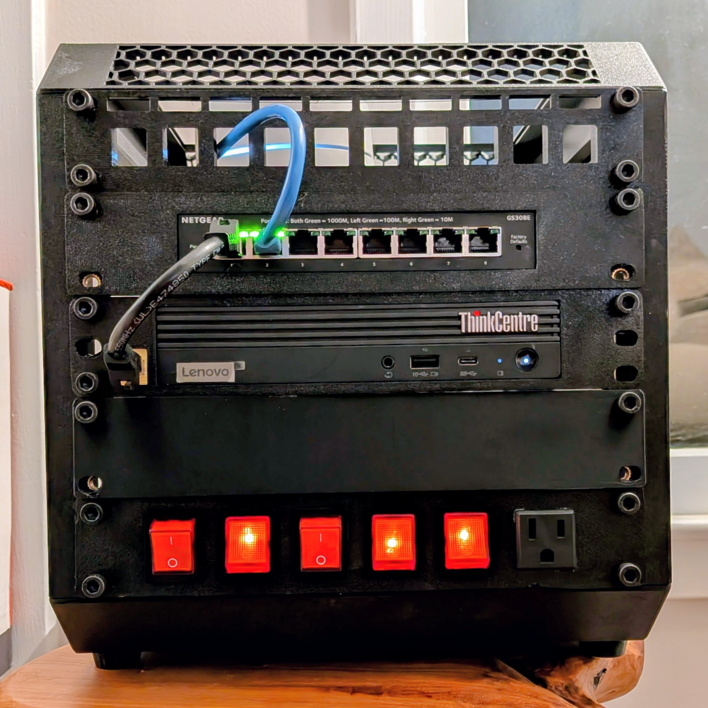

I've wanted to clean up the network side of the house for a while. The goal is simple: move more traffic off Wi-Fi and onto wires. That should make the network faster, more reliable, and easier to reason about when something stops behaving.

Rather than buy a big rack and pretend I'm running a datacenter in the spare room, I chose a small 10-inch setup. It has room for the practical pieces I need without taking over the house.

## The Starting Point

Most of this build is based on 3D printable parts:

- A [LabRax 10-inch 5U rack](https://makerworld.com/en/models/1294480-lab-rax-10-server-rack-5u)
- A [10-inch rackmount PDU](../network-rack-pdu/)
- A Lenovo ThinkCentre [and mount](https://www.printables.com/model/1040412-lenovo-thinkcentre-tiny-10-rack-mount-now-with-opt)
- A [keystone patch panel with labels](https://www.printables.com/model/1190494-10-inch-keystone-patch-panel-with-label)
- A Netgear GS308E switch [and mount](https://makerworld.com/en/models/1859737-netgear-gs308e-screwless-10-inch-rack-mount)

The PDU was fussy enough to deserve its own writeup. The details live here: [Rackmount PDU Remix](../network-rack-pdu/).
The switch mount also needed a little trimming: I clipped off the mounting tabs because they were in the wrong place for my switch.

## Why This Project Exists

This is less about building a "homelab" and more about making the house network less sloppy. Too many devices were on Wi-Fi because that was easy at the time. A small rack gives me a place to terminate runs cleanly, mount the switch properly, and stop accumulating little piles of network gear wherever there happened to be a power outlet.

It also gives me a place to be deliberate about labeling and cable management, which is less exciting than buying hardware but matters more later.

## Next Steps

The next part is getting the printed pieces dialed in, mounted, and wired up.

This is the starting point, but it feels like the right size project: useful, contained, and likely to make everyday life better. If it grows into something more elaborate, I'll pretend that was the plan all along.
