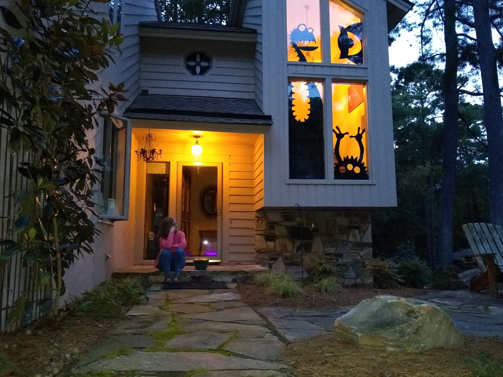
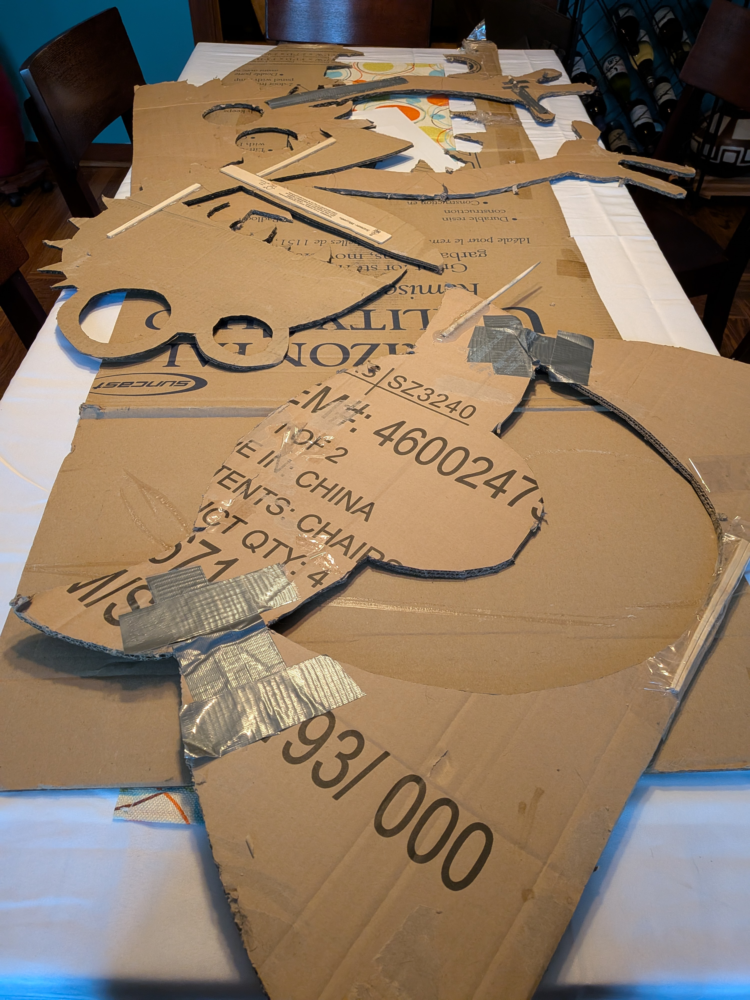
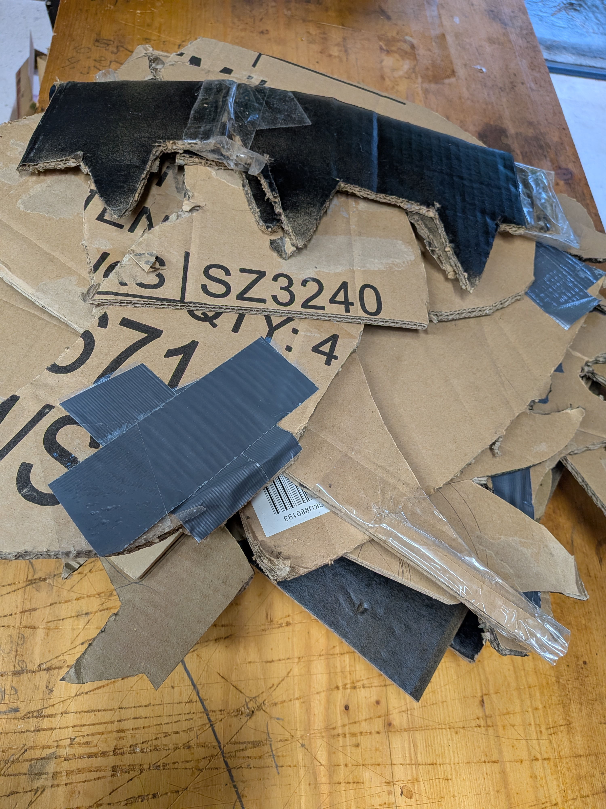
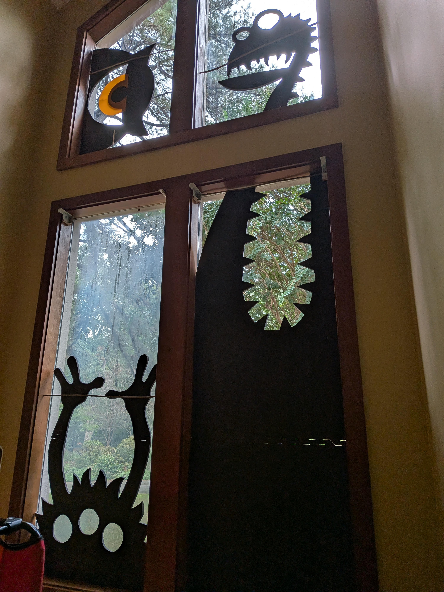

For over a decade, three loyal monsters—**Tyler**, **Russell**, and **Bryan** (formerly known as *Sampson*, as of today’s official name change)—stood watch over my domain. They once even guarded our family one fateful Halloween at *Salubrious View* in Sunset Beach. Born from a humble cardboard box, they struck fear into the hearts of candy-seeking mortals and possibly a few passing HOA representatives.

---

### Retirement of the Old Guard

Time, moisture, and gravity eventually did what no hero could: they destroyed my army. Russell’s once-proud orange vinyl iris tore in battle (and possibly due to tape failure). After years of patchwork repairs, I made the difficult decision: decommission the old guardians.

Their remains were respectfully processed for recycling. It was not a funeral—let’s call it *resource reclamation*. A fitting end for creatures who once terrified trick-or-treaters but could no longer survive a stiff breeze.

---

### The Rise of the New Monsters

From their flattened templates, I forged a new generation—cut from **Harbor Freight Foam Mat Sets**, a material far more befitting an overlord than common corrugated cellulose. Each section detaches for easy storage and redeployment. The new beasts are **sturdier**, **lighter**, and **resistant to mild acts of nature (and neighborly curiosity)**. Russell’s eye has been reborn—his torn vinyl iris replaced by a **3D-printed upgrade**, naturally.

They now guard the lair’s windows once more—unblinking, unyielding, and far easier to mount. Let it be known: progress marches on, even in the dark arts of seasonal home defense.

---

**Status:** Monsters operational. Fear restored. Storage efficiency improved by 300%.

