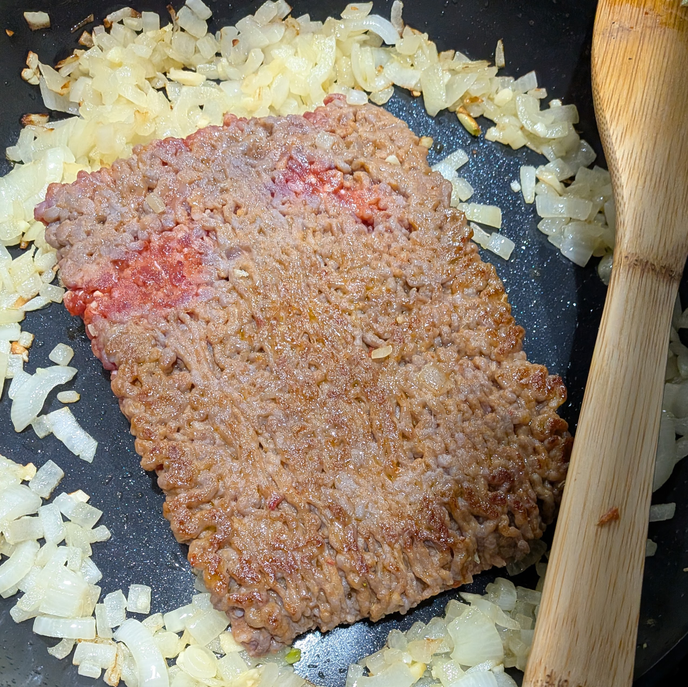

## James's Lasagne

This is my oven-ready sausage lasagne: jarred sauce, plenty of cheese, and a little patience while the sausage browns.

### Ingredients

- 9 oven-ready lasagne noodles, plus broken pieces to fill in where full noodles are too short, uncooked
- 1 lb Italian sausage
- 1 small onion, diced
- 3 cloves garlic, minced
- 1 (15 oz) container ricotta cheese
- 4 cups shredded mozzarella cheese, divided
- 2 cups grated Parmesan cheese, divided
- 2 eggs, lightly beaten
- 2 large jars (about 50 oz total) pasta sauce, your favorite kind
- Red pepper flakes to taste

### Instructions

1. Preheat oven to 350°F.
2. In a medium bowl, combine the ricotta, 2 cups mozzarella, all but a handful of the Parmesan, and the eggs. Mix well.
3. Cook the onion in a large pan until soft, about 5 minutes.
4. Add the minced garlic and cook about 30 seconds.
5. Make a space in the center of the pan. Add the sausage and let it brown on one side without stirring.

6. Flip the sausage, break it up, and brown it.
7. Add the pasta sauce and red pepper flakes to the pan. Stir to combine, then bring to a simmer.
8. Spread 1 cup of the sauce mixture in the bottom of a 9x13-inch baking dish.
9. Add 3 oven-ready noodles, using smaller noodle pieces to fill in the length of the dish where the full noodles do not reach.
10. Spread half of the cheese mixture over the noodles, then add about 2 cups sauce.
11. Add another layer of 3 noodles plus smaller pieces, the remaining cheese mixture, and about 2 cups sauce.
12. Add the final layer of 3 noodles plus smaller pieces, then cover with about 2 cups sauce.
13. Top with the remaining mozzarella and reserved Parmesan.
14. Cover with foil and bake for 55 minutes.
15. Uncover and broil until the cheese is bubbly and starting to brown.
16. Let rest for 15 minutes before cutting.

---

This is one of those recipes that just works. Browning the sausage before it goes into the sauce gives the lasagne a little more richness, and using oven-ready noodles keeps it easy enough for a weeknight or a crowd.
