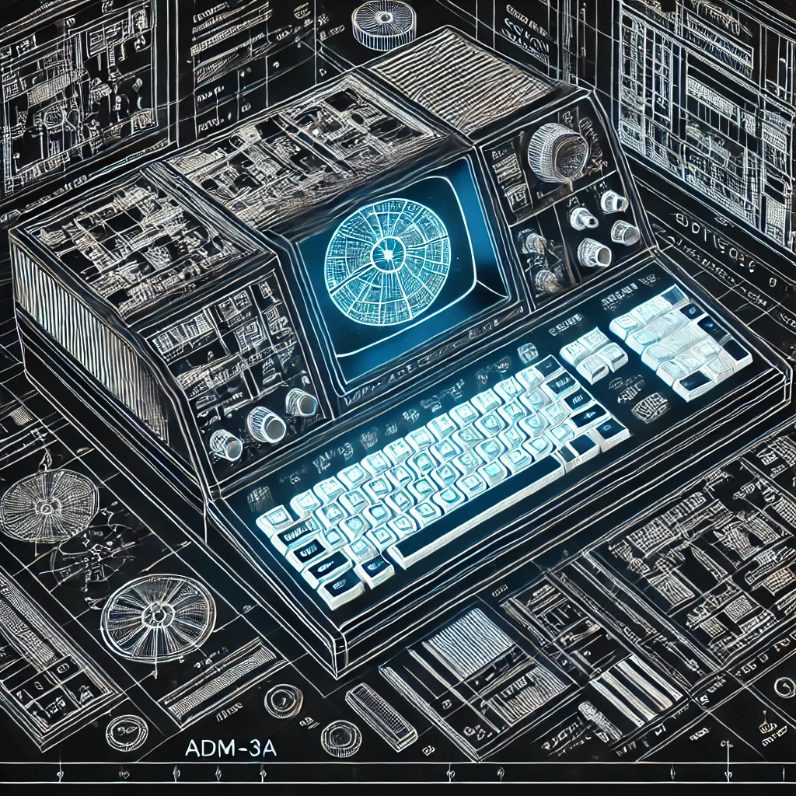
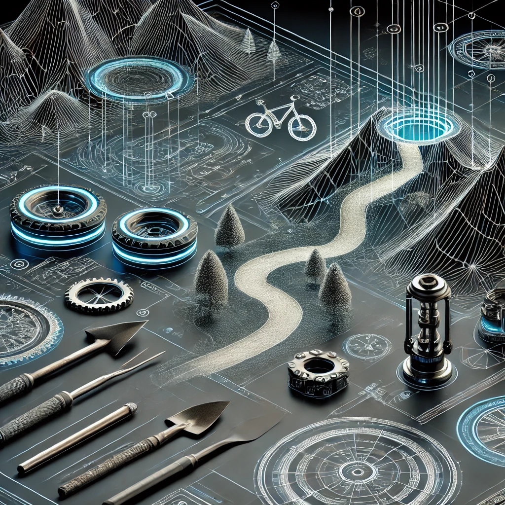

Since embracing my new role as a professional antagonist with a flair for eccentricity, I've decided to assemble a bucket list of shenanigans worthy of my diabolical retirement. Here are the schemes in the works:

## Rocketing to Infamy

My granddad once said I should watch a space shuttle launch, but alas, NASA’s shuttle fleet retired before I could cross that off my list. No matter! A rocket launch will suffice, and I intend to be close enough to feel the heat and hear the earth shake. Whether it’s SpaceX, Blue Origin, or some plucky amateur engineer risking it all, I shall witness this fiery spectacle and make rocket puns the entire time.

## Return to MTB Mayhem

I’ve conquered (well, survived) two legendary events:  
- The **[Shenandoah 100](https://nuemtb.com/shenandoah-100/)**: A punishing endurance race with breathtaking mountain views and breathtaking climbs.  
- The **[Pisgah Mountain Bike Adventure Race (PMBAR)](https://www.pisgahproductions.com/events/pmbar/)**: A test of navigation, grit, and how well you can fake a smile while crawling over rocks.  

While I could go for round three in either of these, I might shake things up and pick a different but brutal event. The thrill lies in finding the perfect mix of scenic trails, camaraderie, and post-race snacks to make the suffering worthwhile. Suggestions for new rides of torment are welcome—bonus points if they involve the phrase “unrelenting climbs” or “mud-soaked chaos.”

Dec 18 2024 Update: Dana suggested the "Old Fart^H^H^H^HFort Fifty." Looking though the [Pisgah Productions](https://www.pisgahproductions.com/) races, I like [that one](https://www.pisgahproductions.com/events/old-fort-fifty/) as well as the [Pisgah 111](https://www.pisgahproductions.com/events/pisgah-111k-mtb-race/) and the [Pisgah 555](https://www.pisgahproductions.com/events/pisgah-55-5k-mtb-race/). Time to fire up a chainsaw and help recovery efforts so we get some dates.

## Vintage Terminal Tinkering

My trusty **ADM-3A terminal** is out of commission—not ideal for a villain’s lair centerpiece. This isn’t just any ADM-3A, mind you; it boasts a rare option to emulate a **Tektronix 4010**, which makes it all the more precious. To revive it, I’m plotting a visit to a **[VCFed](https://vcfed.org/)** repair day. There, surrounded by the heroes of vintage computing, I’ll unleash my terminal in the hopes of restoring it to its former glory. Who knows? With its Tektronix-emulating powers, it might even become my secret weapon for crafting retro evil plans.

## Trail Day Tactics

The **Lake Crabtree County Park** trails are in need of some tender, loving care (or maniacal reinvention). I’m hatching a plot to organize a **trail day** where my trusty Wednesday night mountain bike crew gets roped into maintenance duty. Bribery in the form of cold drinks and post-work tacos may be required. But imagine the trail signage: “Maintained by Evil Supervillains and Friends.” Delightful.

---

These plans are but the start of my master list. Villainy is a lifelong endeavor, after all, and my retirement is just the prologue to a thousand capers. Stay tuned for updates as my schemes unfold. Suggestions for additional escapades are, of course, always welcome.

