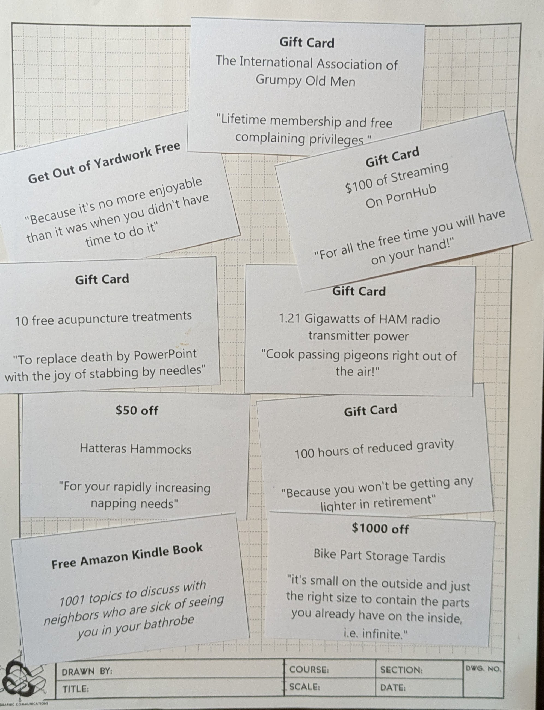
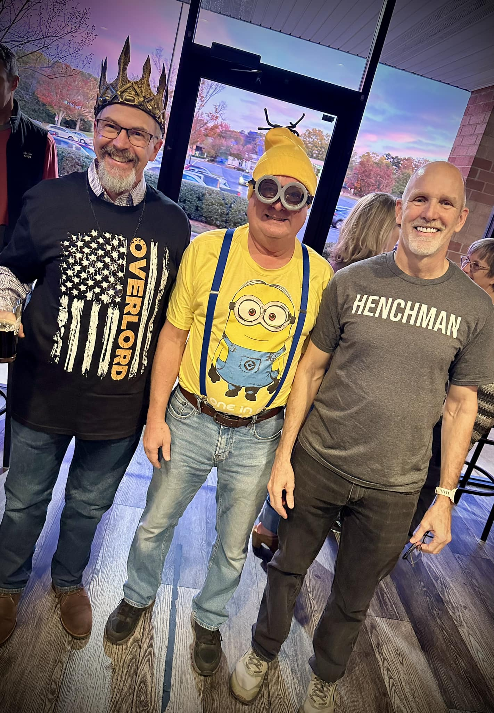

My wife, Lori, outdid herself, throwing me a supervillain-themed retirement party that will surely cement my rise to infamy. Friends, family, coworkers, and neighbors joined me at a local spot in Cary, NC, where we plotted world domination over excellent food, drinks, and plenty of laughs.  

Despite my polite (and villainously ignored) request not to bring gifts, my loyal henchpeople arrived with an arsenal of treasures:  
- **1.5 gallons of assorted fine alcohol**, ensuring no toast would go unmade.  
- **Genetically superior produce**, proof that even the plants are on my side.  
- **A wardrobe upgrade**, complete with a crown that truly solidifies my new title as "Overlord."  
- And the pièce de résistance: **supervillain coupons**. These ingenious creations included everything from “Get Out of Yardwork Free” to $1,000 off a *Bike Part Storage TARDIS*. How my minions knew I needed one of those, I’ll never know.  

  

The highlight of the evening? A photo of me flanked by a *Minion* and a *Henchman*—a trio that could conquer the world… or at least get a really good laugh from everyone at the party.  

  

Special thanks to Lori for orchestrating this devious gathering and to everyone who came to celebrate my transition from corporate overlord to full-time strategic mischief-maker. Retirement suits me, and the crown is just the beginning.  

