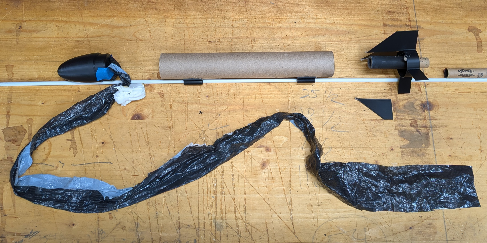
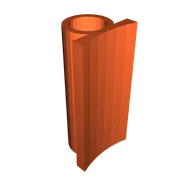

Nate has been promoted from henchling to apprentice, so we set out to build a disposable terror torpedo out of household scraps and hubris. The result: the **Paper Towel Tube Rocket Mk I**, a villainous proof-of-concept for future orbital mischief. Bobby joined the lair crew to troubleshoot the wiring and batteries after a few sulky ignitors.

## Design dossier

- Airframe: a noble paper towel tube, now artfully charred after two launches.  
- Propulsion: Estes B-series motors and obliging ignitors.  
- Structure: 3D-printed nose cone, fin/engine bay assembly, and twin launch rail guides.  
- Payload: custom astronaut (lost their legs in the line of villainy).  
- Recovery: custom parachute that chose *not* to open, because drama.  

Full schematics live on Printables: [Paper Towel Tube Rocket Mk I](https://www.printables.com/model/1517161-paper-towel-tube-rocket-mk-i).

## Field report

Launch one: the ignitor sulked, Bobby rewired, and the rocket finally leapt skyward. The parachute refused to deploy, turning the descent into a ballistic lesson in gravity. Launch two: improved ignition, still no parachute, but the airframe survived with only fashionable burn marks. The astronaut is now shorter—but morale remains high.

## Renderings from the lair

