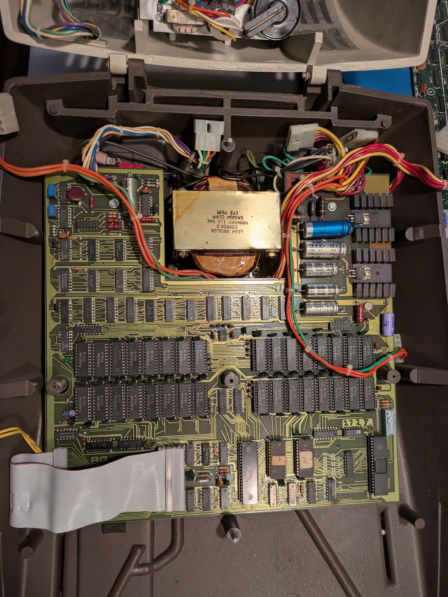
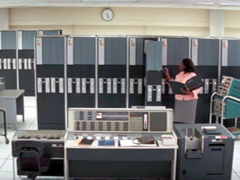
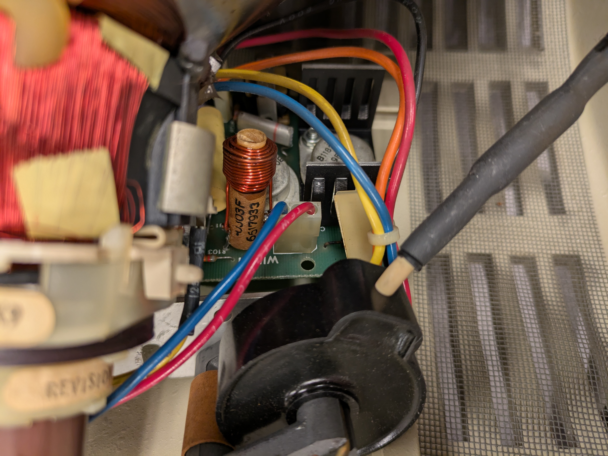
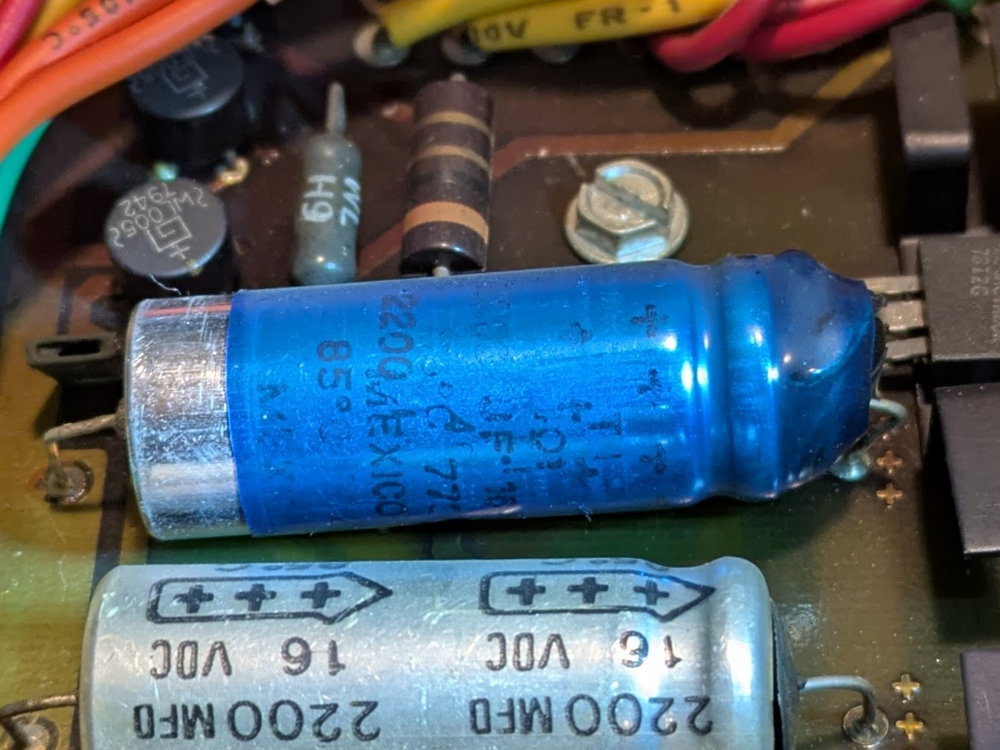

Minions and enthusiasts, gather 'round for an update on the diabolical resurrection of my ADM-3A terminal. With a rare **RG-512 optional graphics board** onboard, this mission was destined for greatness—or at least for copious soldering and caffeine. Here’s the story of triumph, trials, and a band of capable minions who made it all possible.

The adventure took place at **System Source in Maryland**, where the Vintage Computer Federation (VCF) hosted a repair workshop. Despite a snowstorm cutting the second day short, the event was nothing short of spectacular. We even got a tour of their warehouse, which is now home to the IBM 7090 used in the movie *Hidden Figures*.

---

## Goals Achieved:
- **Learn stuff and meet people**: Success! VCF events are a nexus of brilliance and camaraderie.
- **Restore base functionality of the ADM-3A**: It’s alive!
- **Resurrect the RG-512 graphics board**: Vectors on screen!

---

## Obstacles and Victories  

### 1. Faulty Video Board

- Initial diagnostics verified good power, horizontal and vertical signals, and a reasonable video signal from the ADM-3A main board.
- Adjusted potentiometers on the video board until a dot appeared, rolling up the screen.
- The dot brightened with more characters, leading me to suspect horizontal deflection issues.
- Upon inspection, I found a bent component with a bad solder connection.
- After repairs and some tuning, the ADM-3A now **displays text**!

### 2. Faulty RG-512

- Replaced a visibly bulging capacitor on the RG-512.
- Reintegrated the RG-512 into the ADM-3A and entered vectors via keyboard.
- Victory! The ADM-3A now **draws vectors**.

### 3. Display Distortion
- The screen was vertically squished at the top and expanded at the bottom.
- Replaced electrolytic capacitors on the video board and enlisted **Ian, CRT whisperer**, for fine-tuning.
- The display is now **crisp and stable**!

### 4. Serial Communication via RS232
- Refined settings on the ADM-3A's dip switches and on the laptop's USB serial port using `stty`.
- Added a null modem cable to the serial-to-USB connection.
- Success! The ADM-3A now **communicates with modern devices** like a true supervillain’s gadget.

---

## The Minions Behind the Magic
Every villain needs a capable crew, and this mission wouldn’t have succeeded without these champions:  
- **Bill**: Owner of half a dozen ADM-3As and a wealth of knowledge.  
- **Ian**: CRT whisperer and purveyor of capacitors.
- **CJ**: Master of the dark art of discharging CRTs.
- **Ryan**: Event organizer extraordinaire and all-around helper.
- **Kate**: Supplier of tools, cables, and conversation.

---

### Conclusion  
The ADM-3A has risen from the depths of disrepair, with both text and graphics functionality restored and RS232 communication established. This is more than just a victory—it’s a testament to the power of collaboration, vintage tech, and the occasional maniacal laugh.

Stay tuned for more evil schemes involving this marvelous terminal!
